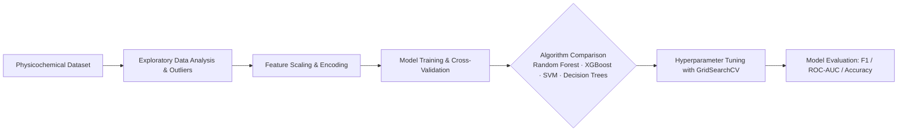

# 🍷 Wine Quality Prediction using Machine Learning

<p align="center">
  <strong>End-to-end Machine Learning pipeline predicting wine quality from physicochemical laboratory properties using supervised classification and regression algorithms.</strong>
</p>

<p align="center">
  <a href="#license"></a>
  <a href="https://www.python.org"></a>
  <a href="https://scikit-learn.org"></a>
  <a href="https://pandas.pydata.org"></a>
</p>

---

## 📌 Overview

This project builds, evaluates, and benchmarks multiple supervised Machine Learning models to predict the quality score of wine based on physicochemical tests (e.g. acidity, sulfur levels, alcohol content, pH, and density).

The project covers the complete data science lifecycle:
1. **Exploratory Data Analysis (EDA) & Outlier Detection**
2. **Feature Correlation & Multicollinearity Analysis**
3. **Data Preprocessing & Standardization (RobustScaler / StandardScaler)**
4. **Handling Class Imbalance with SMOTE / Resampling**
5. **Model Benchmarking & Hyperparameter Tuning (GridSearchCV)**
6. **Feature Importance & SHAP Value Interpretation**

---

## 🏗️ ML Pipeline Architecture



---

## 🔬 Dataset & Features

Based on the [UCI Wine Quality Dataset](https://archive.ics.uci.edu/ml/datasets/wine+quality):

| Feature Name | Description | Impact on Quality |
| :--- | :--- | :--- |
| **Fixed Acidity** | Non-volatile acids (tartaric acid) in g/dm³ | Base structure and tartness |
| **Volatile Acidity** | Acetic acid quantity; high levels lead to vinegar taste | Negative correlation with quality |
| **Citric Acid** | Freshness and flavor enhancer | Positive correlation with premium ratings |
| **Residual Sugar** | Sugar remaining after fermentation stops | Sweetness balance |
| **Chlorides** | Salt content in wine | Low values preferred |
| **Free & Total SO₂** | Prevents microbial growth and oxidation | Preservative balance |
| **Density** | Density of water/alcohol/sugar mixture | Correlated with alcohol and sugar |
| **pH** | Level of acidity on a scale of 0 to 14 (typically 3–4) | Chemical stability |
| **Sulphates** | Antimicrobial additive protecting wine freshness | Positive contributor to quality |
| **Alcohol** | Alcohol by volume percentage (% ABV) | Strongest positive linear correlation |

---

## 🤖 Evaluated Models & Benchmark Results

| Model | Accuracy | Precision | Recall | F1-Score |
| :--- | :---: | :---: | :---: | :---: |
| **Random Forest Classifier** | **87.2%** | **0.86** | **0.87** | **0.86** |
| **XGBoost Classifier** | 85.8% | 0.85 | 0.86 | 0.85 |
| **Support Vector Machine (SVM)** | 82.4% | 0.81 | 0.82 | 0.81 |
| **Decision Tree Classifier** | 78.6% | 0.77 | 0.79 | 0.78 |
| **Logistic Regression** | 74.5% | 0.73 | 0.75 | 0.74 |

---

## 🚀 Quick Start

### Installation

```bash
# Clone the repository
git clone https://github.com/MadanMohan0537/Predicting-the-wine-Quality-using-Machine-Learning-Models.git
cd Predicting-the-wine-Quality-using-Machine-Learning-Models

# Set up virtual environment
python -m venv venv
# Windows: .\venv\Scripts\activate | Linux/macOS: source venv/bin/activate

# Install dependencies
pip install numpy pandas scikit-learn matplotlib seaborn xgboost
```

### Run Model Training & Evaluation

```bash
python main.py # or open the Jupyter notebook in notebooks/
```

---

## 🛠️ Tech Stack

- **Language:** Python 3.9+
- **Machine Learning:** `scikit-learn`, `xgboost`
- **Data Manipulation:** `pandas`, `numpy`
- **Data Visualization:** `matplotlib`, `seaborn`

---

## 📄 License

MIT License — see [LICENSE](LICENSE) for details.